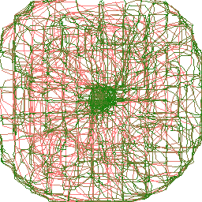
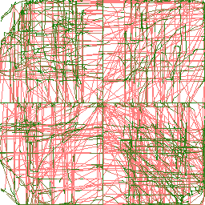
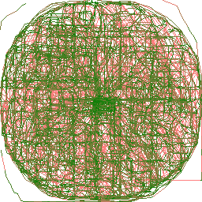

## THUMBSTICKMAP
Простой инструмент для картографирования рабочей области аналоговых стиков. Подключается к указанному джойстику, записывает движения указанных осей, сохраняет карту движений в файл. Полезен для визуализации рабочего поля аналоговых стиков, их оценки и сравнения.

Карты стиков геймпадов Xbox 360, MOCUTE 032 и Nintendo Switch Pro

## Как использовать
1. Подключить геймпад к ПК
2. Задать в скрипте индекс геймпада и индексы его осей для записи
3. Запустить скрипт. Перемещать стик в разных направлениях в пределах мёртвой зоны, в пределах основной зоны, по внешней границе рабочего поля. Запретные области проявятся меньшей плотностью линий. Непроизвольные резкие движения будут визуализированы отдельным цветом и обозначат проблемные области.
4. По заполнении карты закрыть окно для сохранения карты в файл.
